<div align="center">

# 🖥️ Ordering and Billing System

### Restaurant Management Desktop Application built with C# .NET Framework WinForms

A desktop-based Ordering and Billing System designed to streamline restaurant operations through efficient order processing, billing, inventory management, and reporting.


</div>

---

# 📖 Overview

The Ordering and Billing System is a Windows desktop application developed to simplify restaurant operations by managing orders, billing, inventory, staff, and sales reports through an intuitive user interface.

The application emphasizes usability, performance, and efficient business workflow management for restaurants and small food businesses.

---

# ✨ Features

- 🔐 User Authentication
- 🖥️ Point of Sale (POS)
- 🍽️ Order Management
- 💳 Billing & Payment Processing
- 🧾 Receipt Printing
- 📦 Product Management
- 🗂️ Category Management
- 👥 Staff Management
- 📋 Table Management
- 📊 Sales Reports
- 📈 Dashboard
- ⚙️ System Settings
- 💾 Database Backup & Restore
- 📄 Transaction History
- 🖨️ Printable Receipts
- 🔒 Role-Based Access Control (Admin & Staff)

---

# 🛠 Tech Stack

- **Language:** C#
- **Framework:** .NET Framework (WinForms)
- **Database:** MySQL
- **IDE:** Visual Studio 2019

---

# 📸 Screenshots

## Login

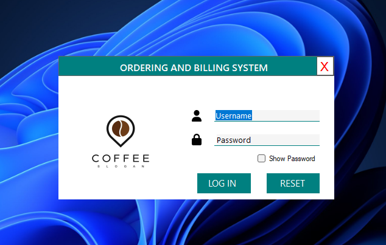

---

## Dashboard

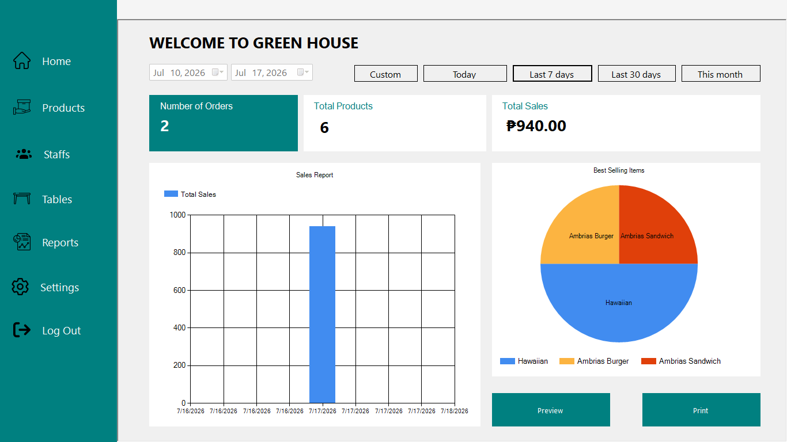

---

## Point of Sale

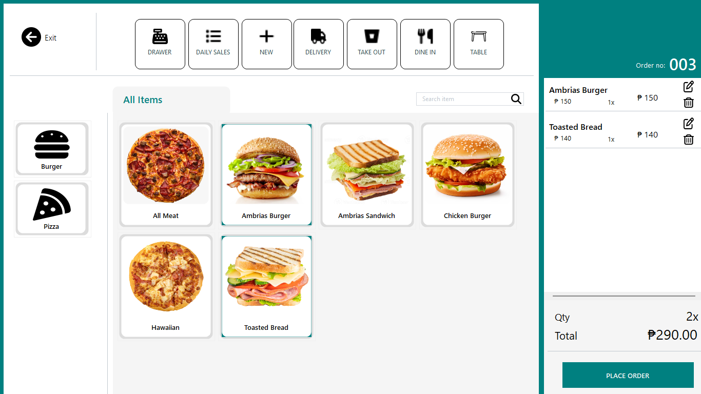

---

## Product Management

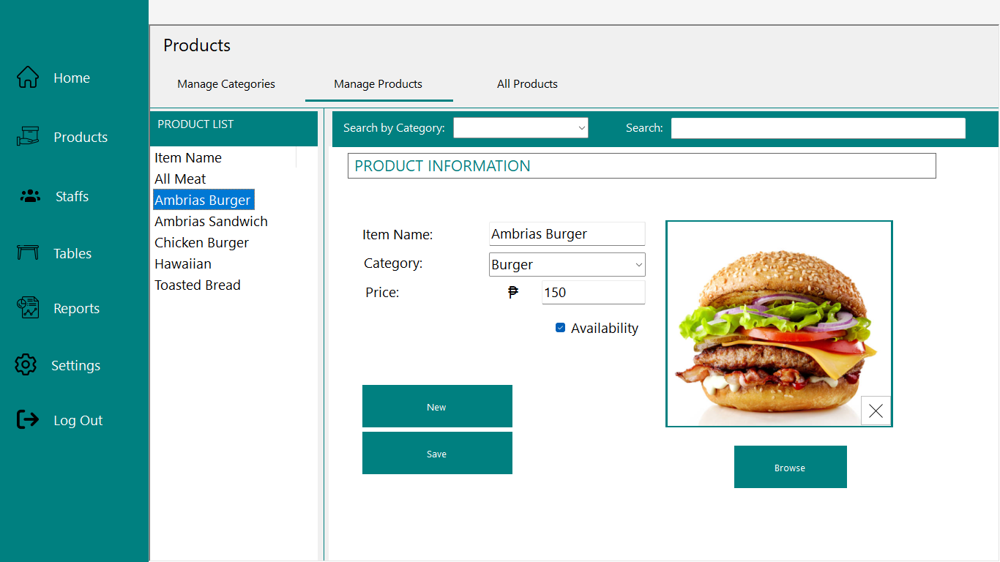

---

## Product List

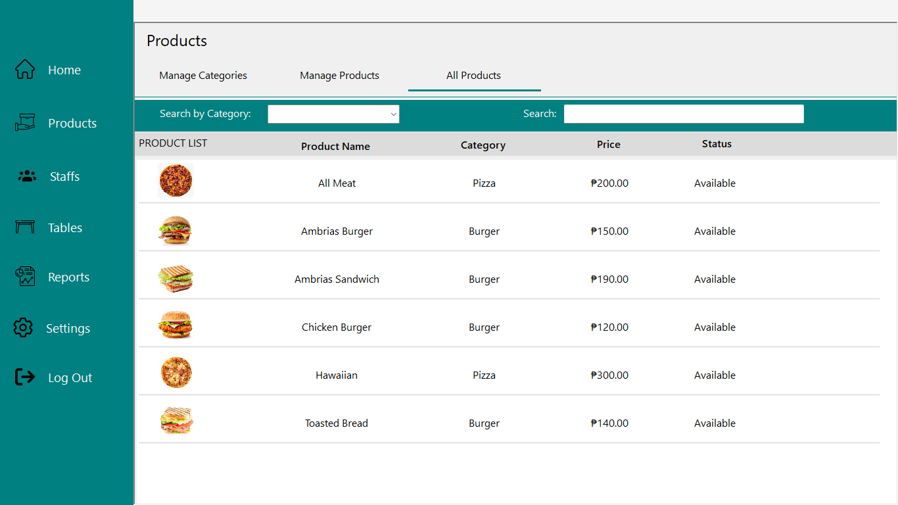

---

## Order List

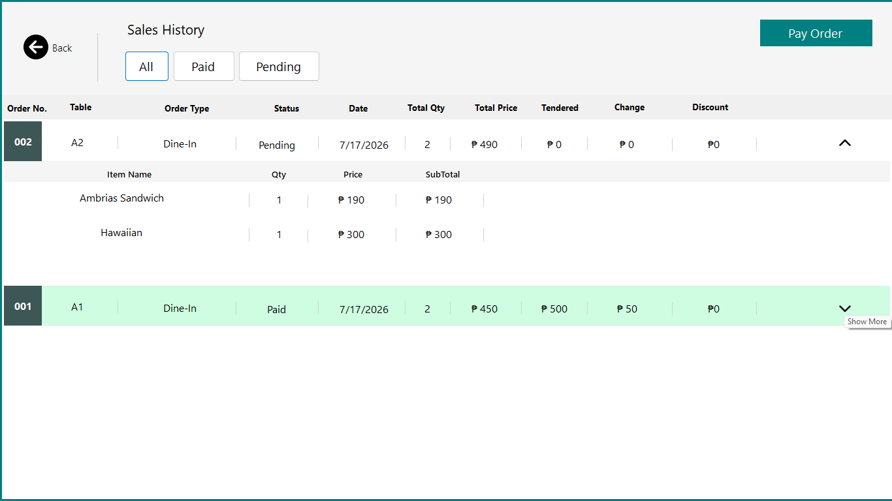

---

## Payment

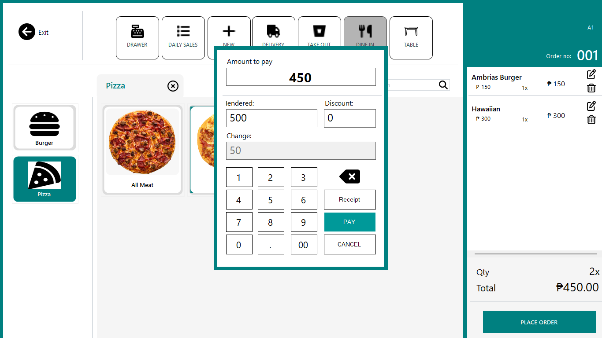

---

## Transactions

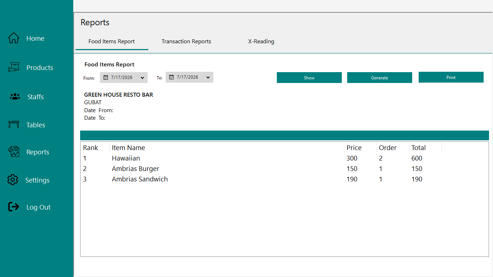

---

## Receipt

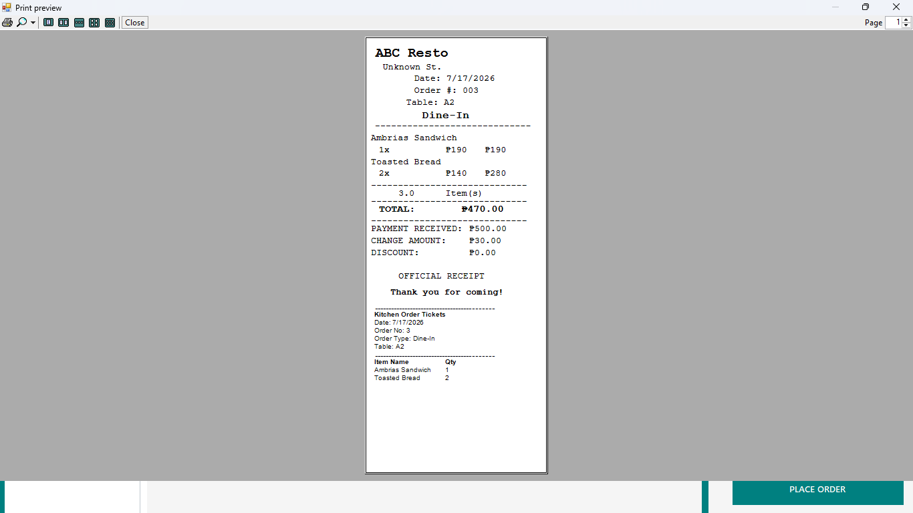

---

## Backup

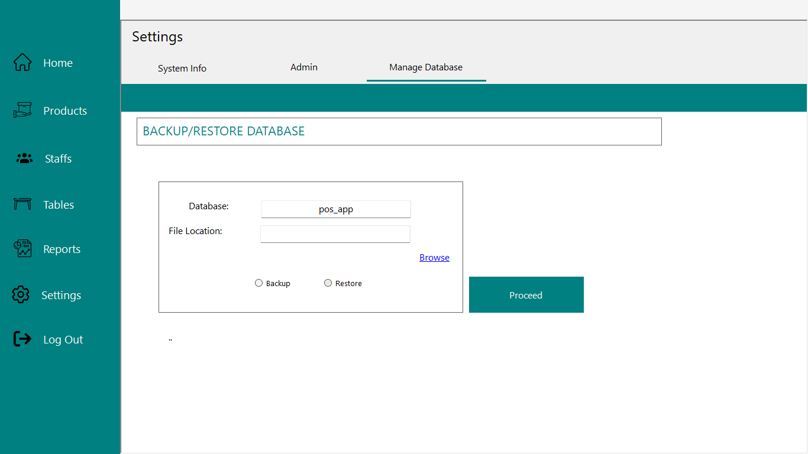

---

## System Information

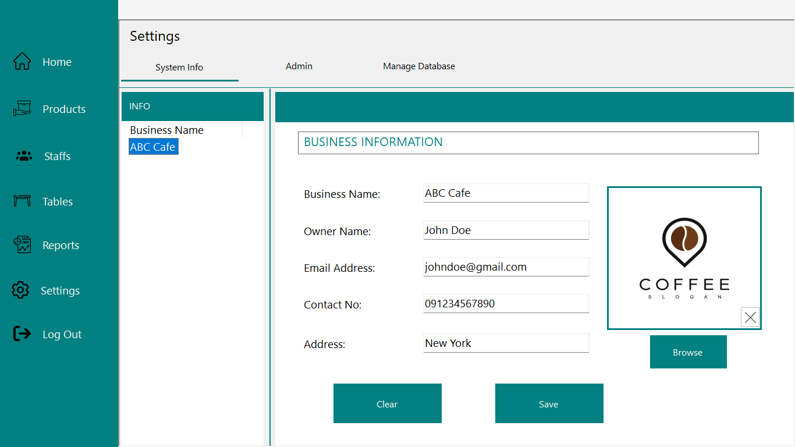

---

# 🚀 Installation

1. Clone the repository.

```bash
git clone https://github.com/tristanbon/ordering-billing-system.git
```

2. Open `OrderingAndBillingSystem.sln` in Visual Studio 2019.

3. Restore NuGet packages if prompted.

4. Import the SQL database.

5. Update the database connection in `App.config`.

6. Build and run the application.

---

# 📂 Project Structure

```text
OrderingAndBillingSystem
├── OrderingAndBillingSystem.sln
├── OrderingAndBillingSystem/
├── Database/
├── Screenshots/
├── README.md
└── LICENSE
```

---

# 📚 Skills Demonstrated

- Desktop Application Development
- Object-Oriented Programming (OOP)
- CRUD Operations
- Database Design
- Report Generation
- UI/UX Design for Desktop Applications
- MySQL Integration

---

# 👨‍💻 Author

**Tristan Bon**

Web Developer | Software Developer

GitHub: https://github.com/tristanbon

---

# 📄 License

This project is licensed under the MIT License.
